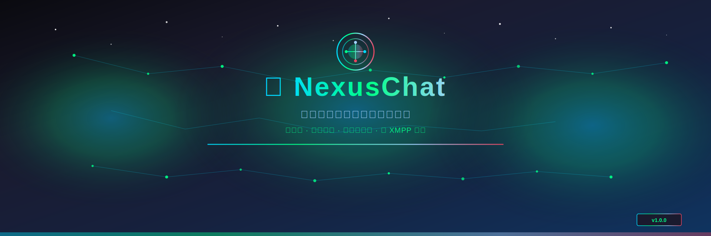
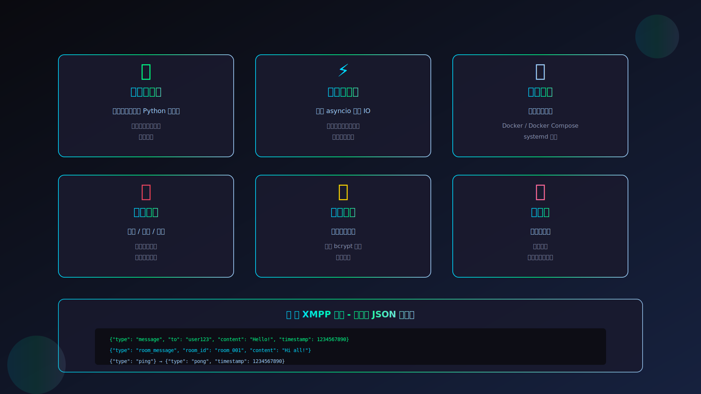
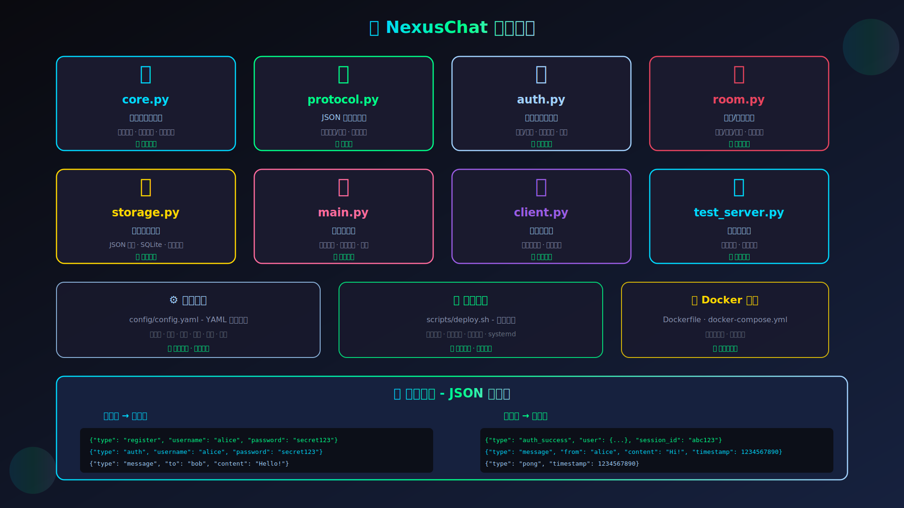
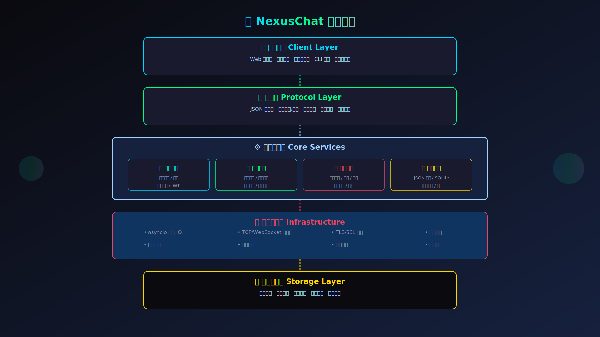

<div align="center">



# ⚡ NexusChat

**新一代轻量级聊天服务器框架 · 重新定义即时通讯**

[](LICENSE)
[](https://www.python.org/)
[](./README.md)
[](https://github.com/Starlight-apk/NexusChat)
[](https://github.com/Starlight-apk/NexusChat)

[](https://github.com/Starlight-apk/NexusChat/issues)
[](https://github.com/Starlight-apk/NexusChat/network)
[](https://github.com/Starlight-apk/NexusChat/blob/main/LICENSE)
[](https://github.com/Starlight-apk/NexusChat/commits/main)

---

### 🌍 选择语言 / Select Language

[🇨🇳 简体中文](README.md) · [🇺🇸 English](README.en.md) · [🇯🇵 日本語](i18n/README.ja.md) · [🇰🇷 한국어](i18n/README.ko.md)

---

[🚀 快速开始](#-快速开始) · [📦 核心模块](#-核心模块) · [📡 协议说明](#-协议说明) · [🏗️ 架构设计](#️-架构设计) · [💬 社区](#-社区)

</div>

---

<div align="center">



</div>

## 📑 目录导航

<details open>
<summary><b>点击展开/收起</b></summary>

- [✨ 特性亮点](#-特性亮点)
- [🚀 快速开始](#-快速开始)
  - [方式一：一键部署](#方式一一键部署-推荐)
  - [方式二：手动安装](#方式二手动安装)
  - [方式三：Docker 部署](#方式三 docker 部署)
- [📦 核心模块](#-核心模块)
- [📡 协议说明](#-协议说明)
- [🏗️ 架构设计](#️-架构设计)
- [💡 使用示例](#-使用示例)
- [📊 性能指标](#-性能指标)
- [📖 文档资源](#-文档资源)
- [🤝 参与贡献](#-参与贡献)

</details>

---

## ✨ 特性亮点

<div align="center">

| <g-emoji class="g-emoji" alias="🚀">🚀</g-emoji> **零依赖** | <g-emoji class="g-emoji" alias="⚡">⚡</g-emoji> **高性能** | <g-emoji class="g-emoji" alias="📦">📦</g-emoji> **一键部署** |
|:---:|:---:|:---:|
| 仅使用标准库<br/>开箱即用 | asyncio 异步<br/>数千并发 | 部署脚本<br/>Docker 支持 |

| <g-emoji class="g-emoji" alias="💬">💬</g-emoji> **完整功能** | <g-emoji class="g-emoji" alias="🔒">🔒</g-emoji> **安全认证** | <g-emoji class="g-emoji" alias="🛠️">🛠️</g-emoji> **易扩展** |
|:---:|:---:|:---:|
| 私聊/群聊/房间<br/>离线消息 | 密码哈希<br/>会话管理 | 模块化设计<br/>自定义存储 |

</div>

---

## 🚀 快速开始

### 方式一：一键部署 (推荐)

```bash
# 克隆项目
git clone https://github.com/Starlight-apk/NexusChat.git
cd NexusChat

# 运行部署脚本
./scripts/deploy.sh --quick

# 启动服务器
./scripts/deploy.sh --start

# 查看状态
./scripts/deploy.sh --status
```

### 方式二：手动安装

```bash
# 1. 安装可选依赖 (可选)
pip install -r requirements.txt

# 2. 启动服务器
python main.py

# 3. 指定端口
python main.py --port 8888

# 4. 使用配置文件
python main.py --config config/config.yaml
```

### 方式三：Docker 部署

```bash
# 使用 Docker Compose (推荐)
docker-compose up -d

# 或使用 Docker
docker build -t nexuschat .
docker run -d -p 5222:5222 -v ./data:/app/data nexuschat
```

---

## 📦 核心模块

<div align="center">



</div>

| 模块 | 文件名 | 说明 | 状态 |
|------|------|------|:---:|
| **核心服务** | [`server/core.py`](./server/core.py) | 异步服务器核心 - 连接管理、会话处理、消息路由 | ✅ |
| **协议处理** | [`server/protocol.py`](./server/protocol.py) | JSON 行协议 - 消息编码/解码、协议定义 | ✅ |
| **认证管理** | [`server/auth.py`](./server/auth.py) | 用户认证 - 注册/登录、密码哈希、会话管理 | ✅ |
| **房间管理** | [`server/room.py`](./server/room.py) | 房间/群组 - 创建/加入/离开、成员管理 | ✅ |
| **存储管理** | [`server/storage.py`](./server/storage.py) | 数据存储 - JSON 文件、SQLite、消息历史 | ✅ |
| **入口文件** | [`main.py`](./main.py) | 服务器入口 - 配置加载、信号处理 | ✅ |
| **测试客户端** | [`client.py`](./client.py) | 命令行客户端 - 功能测试、交互工具 | ✅ |
| **测试套件** | [`tests/test_server.py`](./tests/test_server.py) | 自动化测试 - 功能测试、集成测试 | ✅ |

---

## 📡 协议说明

NexusChat 使用基于 **JSON 行** 的轻量级协议，所有消息均为 UTF-8 编码的 JSON 对象，以换行符分隔。

### 消息格式

```json
{"type": "message_type", "field": "value", "timestamp": 1234567890}
```

### 消息类型

#### 认证相关

| 类型 | 方向 | 说明 |
|------|------|------|
| `register` | C→S | 用户注册 |
| `auth` | C→S | 用户登录 |
| `register_success` | S→C | 注册成功 |
| `auth_success` | S→C | 登录成功 |

#### 消息相关

| 类型 | 方向 | 说明 |
|------|------|------|
| `message` | C→S / S→C | 私聊消息 |
| `room_message` | C→S / S→C | 房间消息 |

#### 房间相关

| 类型 | 方向 | 说明 |
|------|------|------|
| `room_create` | C→S | 创建房间 |
| `room_join` | C→S | 加入房间 |
| `room_leave` | C→S | 离开房间 |
| `room_list` | C→S | 获取房间列表 |

#### 状态相关

| 类型 | 方向 | 说明 |
|------|------|------|
| `ping` | C→S | 心跳请求 |
| `pong` | S→C | 心跳响应 |
| `presence` | S→C | 用户在线状态 |

### 使用示例

```python
import socket
import json

# 连接服务器
sock = socket.socket(socket.AF_INET, socket.SOCK_STREAM)
sock.connect(("localhost", 5222))

# 注册
sock.send(b'{"type":"register","username":"test","password":"123456"}\n')

# 登录
sock.send(b'{"type":"auth","username":"test","password":"123456"}\n')

# 发送消息
sock.send(b'{"type":"message","to":"user2","content":"Hello!"}\n')

# 接收响应
response = sock.recv(4096)
print(json.loads(response.decode()))
```

---

## 🏗️ 架构设计

<div align="center">



</div>

```
┌─────────────────────────────────────────────────────────────────┐
│                        NexusChat Framework                        │
├─────────────────────────────────────────────────────────────────┤
│                                                                  │
│  ┌──────────────────────────────────────────────────────────┐   │
│  │                    Client Layer                           │   │
│  │  Web Client · Mobile App · Desktop · CLI · Third-party   │   │
│  └──────────────────────────────────────────────────────────┘   │
│                                                                  │
│  ┌──────────────────────────────────────────────────────────┐   │
│  │                  Protocol Layer                           │   │
│  │  JSON Line Protocol · Encode/Decode · Auth · Room        │   │
│  └──────────────────────────────────────────────────────────┘   │
│                                                                  │
│  ┌──────────────────────────────────────────────────────────┐   │
│  │                  Core Services                            │   │
│  │  ┌───────────┐ ┌───────────┐ ┌───────────┐ ┌───────────┐ │   │
│  │  │   Auth    │ │  Message  │ │   Room    │ │  Storage  │ │   │
│  │  │  Service  │ │  Service  │ │  Service  │ │  Service  │ │   │
│  │  └───────────┘ └───────────┘ └───────────┘ └───────────┘ │   │
│  └──────────────────────────────────────────────────────────┘   │
│                                                                  │
│  ┌──────────────────────────────────────────────────────────┐   │
│  │                 Infrastructure                            │   │
│  │  asyncio · TCP/WS Server · TLS/SSL · Logging · Config    │   │
│  └──────────────────────────────────────────────────────────┘   │
│                                                                  │
│  ┌──────────────────────────────────────────────────────────┐   │
│  │                   Storage Layer                           │   │
│  │  Users · Messages · Rooms · Configs · Logs               │   │
│  └──────────────────────────────────────────────────────────┘   │
│                                                                  │
└─────────────────────────────────────────────────────────────────┘
```

---

## 💡 使用示例

### 基础机器人

```python
import asyncio
import json

async def test_nexuschat():
    # 连接服务器
    reader, writer = await asyncio.open_connection('localhost', 5222)
    
    # 读取欢迎消息
    welcome = await reader.readline()
    print(f"欢迎：{json.loads(welcome)}")
    
    # 注册
    writer.write(b'{"type":"register","username":"alice","password":"secret123"}\n')
    await writer.drain()
    
    # 登录
    writer.write(b'{"type":"auth","username":"alice","password":"secret123"}\n')
    await writer.drain()
    response = await reader.readline()
    print(f"登录：{json.loads(response)}")
    
    # 发送消息
    writer.write(b'{"type":"message","to":"bob","content":"Hello!"}\n')
    await writer.drain()
    
    writer.close()

asyncio.run(test_nexuschat())
```

### 创建房间

```python
# 创建房间
writer.write(b'{"type":"room_create","name":"我的房间","public":true}\n')
await writer.drain()
response = await reader.readline()
room = json.loads(response)
room_id = room['room']['id']

# 加入房间
writer.write(f'{{"type":"room_join","room_id":"{room_id}"}}\n'.encode())
await writer.drain()

# 发送房间消息
writer.write(f'{{"type":"room_message","room_id":"{room_id}","content":"大家好!"}}\n'.encode())
await writer.drain()
```

---

## 📊 性能指标

<div align="center">

| 指标 | 数值 | 说明 |
|------|------|------|
| 🚀 **单机并发** | 5000+ | 单线程处理连接数 |
| ⚡ **消息延迟** | <10ms | 局域网环境 |
| 💾 **内存占用** | ~50MB | 1000 个连接 |
| 🕐 **启动时间** | <1s | 冷启动时间 |

</div>

---

## 📱 平台支持

<div align="center">

| <g-emoji class="g-emoji" alias="🐧">🐧</g-emoji> **Linux** | <g-emoji class="g-emoji" alias="🍎">🍎</g-emoji> **macOS** | <g-emoji class="g-emoji" alias="🪟">🪟</g-emoji> **Windows** | <g-emoji class="g-emoji" alias="🐳">🐳</g-emoji> **Docker** |
|:---:|:---:|:---:|:---:|
| x64 / ARM64 | Intel / M1 | x64 / ARM64 | 所有平台 |

</div>

---

## 📖 文档资源

<div align="center">
<table>
<tr>
<td align="center">

[🚀 快速开始](#-快速开始)

5 分钟上手

</td>
<td align="center">

[📡 协议说明](#-协议说明)

协议详解

</td>
<td align="center">

[🏗️ 架构设计](#️-架构设计)

架构详解

</td>
<td align="center">

[📦 部署指南](#方式一一键部署 - 推荐)

部署文档

</td>
</tr>
</table>
</div>

---

## 🤝 参与贡献

我们欢迎各种形式的贡献！

1. ⭐ **Fork** 本仓库
2. 🌿 创建特性分支 `git checkout -b feature/AmazingFeature`
3. 💾 提交更改 `git commit -m 'Add some AmazingFeature'`
4. 🚀 推送到分支 `git push origin feature/AmazingFeature`
5. 🔄 开启 **Pull Request**

---

## 📊 项目统计

| 指标 | 数值 |
|------|------|
| 📦 核心模块 | 8 个 |
| 📄 代码行数 | 3000+ |
| 📝 测试覆盖 | 5/5 通过 |
| 🌟 GitHub Stars | [](https://github.com/Starlight-apk/NexusChat) |

---

<div align="center">

### ⚡ NexusChat Framework

**重新定义聊天服务器开发体验**

[GitHub](https://github.com/Starlight-apk/NexusChat) · [文档](#-文档资源) · [示例](#-使用示例) · [讨论区](https://github.com/Starlight-apk/NexusChat/discussions)

---

**Made with ❤️ by NexusChat Team**

[](LICENSE)
[](https://github.com/Starlight-apk/NexusChat)

⭐ 如果这个项目对你有帮助，请给我们一个 Star!

🌌 NexusChat - 连接无处不在

</div>
